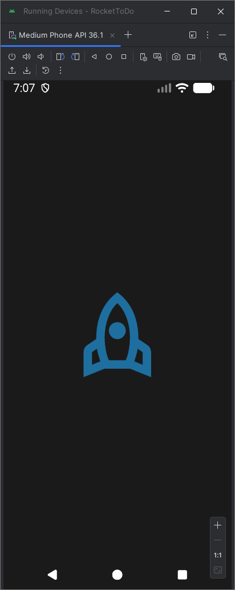
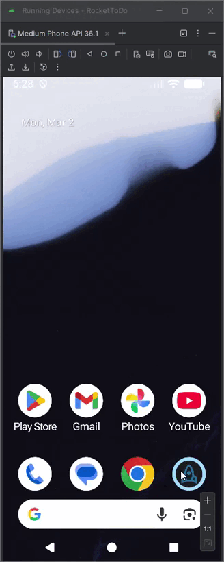

# 🚀 RocketToDo

Aplicativo Android de gerenciamento de tarefas desenvolvido em **Java** com **Android Studio**, inspirado no layout do projeto [todo-rocketseat](https://github.com/RafaelDesenvolvedor1/todo-rocketseat) — uma versão anterior construída em React para web.

> Projeto desenvolvido para fins de estudo e prática de desenvolvimento Android com layouts pré-projetados.

---

## 📱 Preview

<p align="center">
  
  &nbsp;&nbsp;
  
</p>

---

## 🛠️ Tecnologias

- Java
- Android Studio
- SQLite3 — armazenamento local de tarefas

---

## 🔗 Projetos Relacionados

| Projeto | Tecnologia | Armazenamento |
|---|---|---|
| [RocketToDo](https://github.com/RafaelDesenvolvedor1/RocketToDo) | Java (Android Studio) | SQLite3 |
| [todo-rocketseat](https://github.com/RafaelDesenvolvedor1/todo-rocketseat) | React (Web) | Async Storage |

> As duas aplicações são **independentes entre si** — não há uma API conectando-as. Ambas foram criadas separadamente para estudo e prática de desenvolvimento com layouts pré-projetados.

---

## ✨ Funcionalidades

- ✅ Criar tarefas
- ✅ Marcar tarefas como concluídas
- ✅ Remover tarefas
- ✅ Persistência de dados com SQLite3

---

## 🚀 Como executar

### Pré-requisitos

- [Android Studio](https://developer.android.com/studio) instalado
- JDK 11+
- Emulador Android ou dispositivo físico com depuração USB ativada

### Instalação

```bash
# Clone o repositório
git clone https://github.com/RafaelDesenvolvedor1/RocketToDo.git
```

1. Abra o **Android Studio**
2. Selecione **Open an existing project** e aponte para a pasta clonada
3. Aguarde o Gradle sincronizar as dependências
4. Clique em **Run ▶** para executar no emulador ou dispositivo

---

## 📂 Estrutura do Projeto

```
RocketToDo/
├── app/
│   ├── src/
│   │   ├── main/
│   │   │   ├── java/
│   │   │   │   └── ...activities, adapters, database
│   │   │   ├── res/
│   │   │   │   ├── layout/
│   │   │   │   └── drawable/
│   │   │   └── AndroidManifest.xml
│   └── build.gradle
├── gradle/
└── build.gradle
```

---

## 👨‍💻 Autor

Feito por **Rafael Desenvolvedor** — desenvolvido para estudo e prática de desenvolvimento Android nativo.

